  <h1>Aryan Singh (aka insane)</h1>

## About Me

* **I’m currently working on:** Searching something cool to work on.
* **I’m currently interested in:** Graphics Programming.
*  **I’m looking to collaborate on:** Linux, FOSS, and Rust projects.
*  **Ask me about:** Linux ricing, Neovim, and system tweaking.
*  **Pronouns:** He/Him
*  **Fun fact:** Most of my work lives on the edge between “this could break everything” and “that actually turned out alright.”

---

##  My Tech Stack

<h2 align="center"> Languages </h2>

  
  
  
  
  
  
  
  
  

<h2 align="center"> Frameworks </h2>

  
  
  
  

<h2 align="center"> Databases </h2>

  
  
  
  

<h2 align="center"> DevOps & Cloud </h2>

  
  
  

<h2 align="center"> Tools & System </h2>

  
  
  
  
  

---

## Currently Learning / Exploring

---

  
  
   
   
  <i>"I haven’t lost my mind, it’s backed up on the server, and the network is down."</i>

